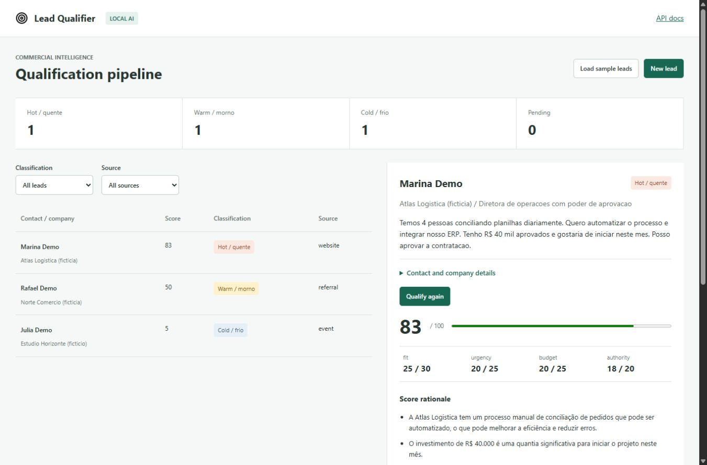

# AI Lead Qualifier

A local B2B qualification workspace with explainable commercial scoring, next-action recommendations and an explicitly simulated CRM destination. Built by [Thierry Azevedo](https://github.com/ThierryDev499).



## Problem

Inbound leads often arrive with uneven information. This application organizes business context, asks a local model to assess commercial fit and presents the reasons for an operator to review. It does not autonomously send messages or make contractual commitments.

## Features

- Lead registration: name, company, email, phone, role, company size, segment, estimated BRL budget, interest, message and source.
- Local LLM evaluation of fit, urgency, budget and decision authority.
- Validated 0-100 score, cold/warm/hot classification, reasons, intent, next action and suggested outreach.
- Persistent history, score breakdown, dashboard and classification/source filters.
- REST API and authenticated webhook with idempotent receipt and conflicting-payload rejection.
- Local SQLite CRM simulator with repeatable upsert and an explicit `simulated: true` response.
- Three fictional leads. Data is seeded on request; no scores are fabricated.

## Scoring contract

The model assigns bounded components: fit 0-30, urgency 0-25, budget 0-25, authority 0-20. The API sums them, validates the schema and derives the label deterministically: 0-39 `frio`, 40-69 `morno`, 70-100 `quente`. Each qualification stores the model name, rubric version and full reasoning snapshot.

This is an explainable heuristic assessed by a language model, **not a calibrated probability of closing a deal**. Unknown evidence should score lower. Outputs can be wrong and require business review. The system must not be used for employment, credit or other high-stakes eligibility decisions.

## Run

Requires Python 3.11+ and a running [Ollama](https://ollama.com/).

```sh
ollama pull llama3.2:3b
python -m venv .venv
# Windows: .venv\Scripts\activate
# macOS/Linux: source .venv/bin/activate
pip install -r requirements.lock
uvicorn app.main:app --host 127.0.0.1 --port 8104
```

Open http://127.0.0.1:8104. Load the sample leads, select one and qualify it. Inspect the score breakdown and suggested approach. **Sync to demo CRM** writes only to a local table; it does not contact Salesforce, HubSpot or any real CRM.

`.env.example` documents `OLLAMA_URL`, `CHAT_MODEL`, `DATA_DIR` and `WEBHOOK_TOKEN`. No paid API or API key is required for inference. Model downloads require internet. Personal contact fields (`name`, `email`, `phone`) are omitted from the model request; free-text messages may still contain personal data supplied by an operator.

## Architecture

```text
Form / REST / authenticated webhook -> Pydantic -> SQLite lead
Business fields (without contact fields) -> Ollama structured output
Validated criteria -> score + deterministic label -> audit history
Qualified lead -> explicit local CRM simulation -> stable demo record ID
```

`app/ai.py` handles Ollama requests and timeouts; `app/main.py` implements validation, persistence and API routes; `web/` is the responsive work surface; `examples/` contains fictional inputs and actual example output; `tests/` covers the API boundaries.

## Endpoints

| Method   | Route                      | Purpose                                                  |
| -------- | -------------------------- | -------------------------------------------------------- |
| GET      | `/api/health`              | App/model configuration, not model readiness             |
| GET/POST | `/api/leads`               | Filter/list/create leads                                 |
| GET      | `/api/leads/{id}`          | Detail, qualification and audit history                  |
| POST     | `/api/leads/{id}/qualify`  | Local-model qualification                                |
| POST     | `/api/leads/{id}/crm-sync` | Local CRM simulator upsert                               |
| POST     | `/api/webhooks/leads`      | Authenticated, idempotent lead receipt                   |
| POST     | `/api/samples`             | Idempotently load the three fictional leads              |
| GET      | `/api/dashboard`           | Stored classification counts, mean score and CRM records |

Interactive OpenAPI: http://127.0.0.1:8104/docs.

```sh
curl -X POST http://127.0.0.1:8104/api/samples
curl -X POST http://127.0.0.1:8104/api/leads/LEAD_ID/qualify
curl -X POST http://127.0.0.1:8104/api/leads/LEAD_ID/crm-sync
curl 'http://127.0.0.1:8104/api/leads?classification=quente&source=website'
```

For webhooks send the same lead shape as `examples/leads.json`, `X-Webhook-Token` and a unique `Idempotency-Key` (letters, digits, hyphen/underscore, maximum 100 characters). Replays return the existing lead with 200; conflicting data for the same key returns 409. No configured token means 503; invalid tokens return 401. Missing/invalid fields return 422.

The response to qualification contains the original lead, component scores, derived classification, model reasoning and audit events. Model failure returns 503; invalid output returns 502 without replacing the existing qualification. `examples/qualification-response.json` is exported from the live fictional demo, not written as a substitute for inference.

## Testing and Docker

```sh
python -m pytest -q
docker compose up --build
```

Tests cover score bounds/labels, filters, CRM idempotency, webhook authentication/replays, input validation, model failures and omission of contact fields from inference. Unit tests use a fake model boundary and do not validate model accuracy. [Verification notes](docs/verification.md) record live checks; [mobile screenshot](docs/mobile.png).

Docker uses a non-root user, a named data volume and loopback port 8104. Host Ollama must be reachable via `host.docker.internal`; Linux hosts may need Ollama configured for the Docker bridge. Local Docker execution was not verified while Docker Engine was unavailable.

## Security and limitations

- Local single-user service without general API authentication. Do not expose it publicly without authentication, TLS, authorization, quotas and tenant isolation.
- Webhook authentication protects only the webhook, not the other local routes.
- No live CRM connector, outbound messaging, enrichment, scheduling or trained conversion model.
- Lead messages are untrusted. The model has no tools; instructions attempt to resist prompt injection but cannot guarantee a truthful score.
- Personal contact records and generated text are persisted locally. No customer data or secrets are included in the repository. No deletion/retention workflow is included.
- Requalification preserves earlier analyses in history. A CRM simulation is a snapshot and must be synced again after requalification.

Model output follows [Ollama structured outputs](https://docs.ollama.com/capabilities/structured-outputs). Lucide icons: ISC license in `web/LICENSE`.
